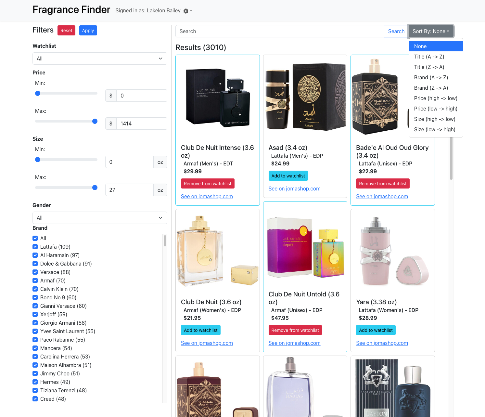

# Fragrance Finder 
## Members (Name - GitHub)
- Lakelon Bailey - LakelonBailey
- Stephen Souther - ssouther
- William Duff - Shm00py
- Jacob Kennedy - BlueNinja420
- Kien Nguyen - KienKong
- Faithful Odoi - BigFaith
- Nolan Coffey - ncoffey3

## Screenshot of Home Page:

## Description
Fragrance Finder is a web application that allows users to find the best price of their favorite fragrances. Fragrance Finder compiles fragrance information from over 8 different fragrance sites to ensure that we provide users with the most up-to-date best prices. By creating an account and adding fragrances to their watchlist, users will recieve email communication regarding price drops on those fragrances. Users are also given several different metrics by which to sort and filter fragrances to find what they're looking for.

## Technologies used
- Frontend
    - React
    - React Bootstrap
    - React Responsive Masonry
    - JSON Web Token (JWT)
- Backend
    - Sequelize (MySQL)
    - Express.js
    - JSON Web Token (JWT)
- Web Scraping (Python scripts)
    - Playwright
    - Beautiful Soup
    - Chromium

## Setup
### Install Node
1. Install the latest version of node at [NodeJs.org](https://nodejs.org)
### Install MySQL
2. Install the latest version of MySQL at [MySQL.com](https://www.mysql.com/downloads/)
### Install Chromium
3. Install the latest version of Chromium at [Chromium.org](https://www.chromium.org). Without Chromium installed, the web scrapers will not be able to function.
### Clone Repo
4. Clone repository found at [github.com/utk-cs340-fall23/FragranceFinder](https://github.com/utk-cs340-fall23/FragranceFinder)
### Install Dependencies
5. From the root directory, run this command: `npm i; cd backend; npm i; cd ../frontend; npm i;`
### Setting environment variables
6. A .env file must be created in the `backend` directory with set variables for logging in to the database and email host.
   * `DB_HOST=localhost` Host URL
   * `DB_USER=root` Username
   * `DB_PASSWORD=password` Password
   * `DB_NAME` Database name
   * `EMAIL_HOST=smtp.gmail.com` SMTP server URL
   * `EMAIL_PORT=465` SMTP server port
   * `EMAIL_SECURE=false` TLS encryption
   * `EMAIL_USER=example@gmail.com` Email address of host
   * `EMAIL_PASS=password` Password for email host
   * `JWT_SECRET=1234` JWT Token
   * `PYTHON_PATH="python"` Leave this undefined if using a virtual environment
### Start development servers
7. Open two different terminals: one for the backend directory and one for the frontend directory.
8. Starting backend: run `npm run start` in the `backend` directory.
9. Starting frontend: run `npm run start` in the `frontend` directory.
### Start regular server
10. Run this command from the root directory to start the regular server: `cd frontend; npm run build; cd ../backend; npm run start;`. If it is not necessary to recreate the frontend build, simply run `cd backend; npm run start;`.
### Using Web Scrapers
11. Our web scraping scripts are written in Python. They require usage of a Python virtual environment. In order to create this, move to the `backend` directory and run `python3 -m venv venv`. This will create a virtual environment called `venv`. To activate the environment, run `source venv/bin/activate`. Finally, in order to install Python dependenices, run `pip install -r requirements.txt`.

## License
MIT - Found in LICENSE.txt
